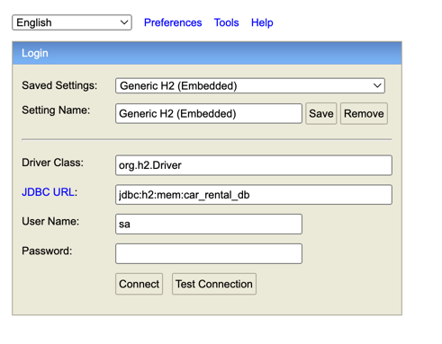

# Lab 2 - Car Service Application

## Overview
This project is a Car Service Application that uses an H2 in-memory database. It allows users to interact with a car rental database.

## Getting Started
To run the application, follow these steps:

### 1. Launch the Application
Run the **`CarServiceApplication`** located in the following directory:
src/java/com/example/oolab1

### 2. Access the H2 Console
Once the application is running, open your web browser and go to:
https://localhost:8080/h2-console/

### 3. Connect to the Database
In the **H2 Console**, enter the following information in the **JDBC URL** field:

jdbc:h2:mem:car_rental_db

> *(Refer to the attached image for visual guidance)*

Leave other fields as default (e.g., username and password) unless otherwise specified in your project setup.

## Conclusion
This lab demonstrates the use of the H2 in-memory database for managing a car rental service. Use the H2 Console to explore the database structure, execute queries, and interact with the car rental data.

